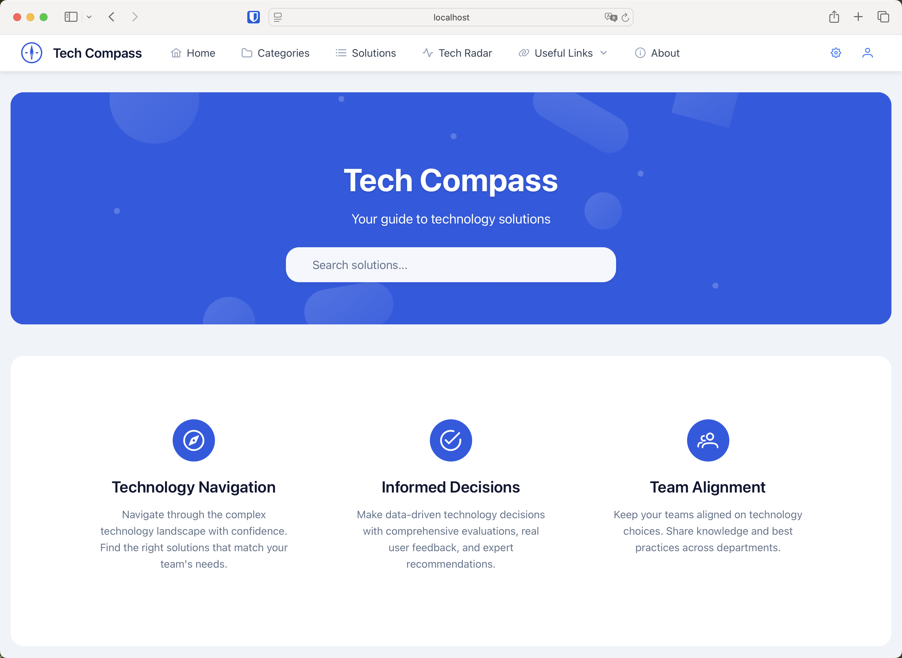
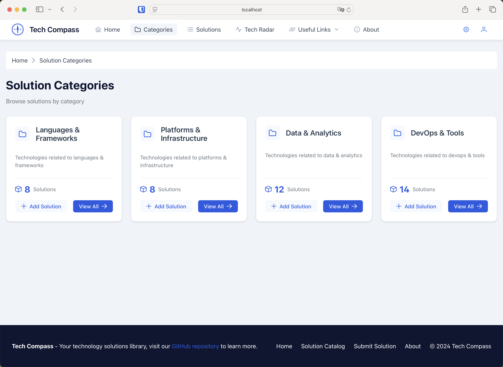
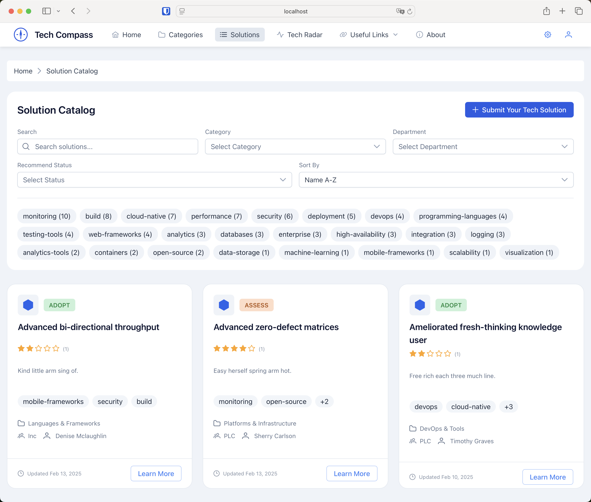
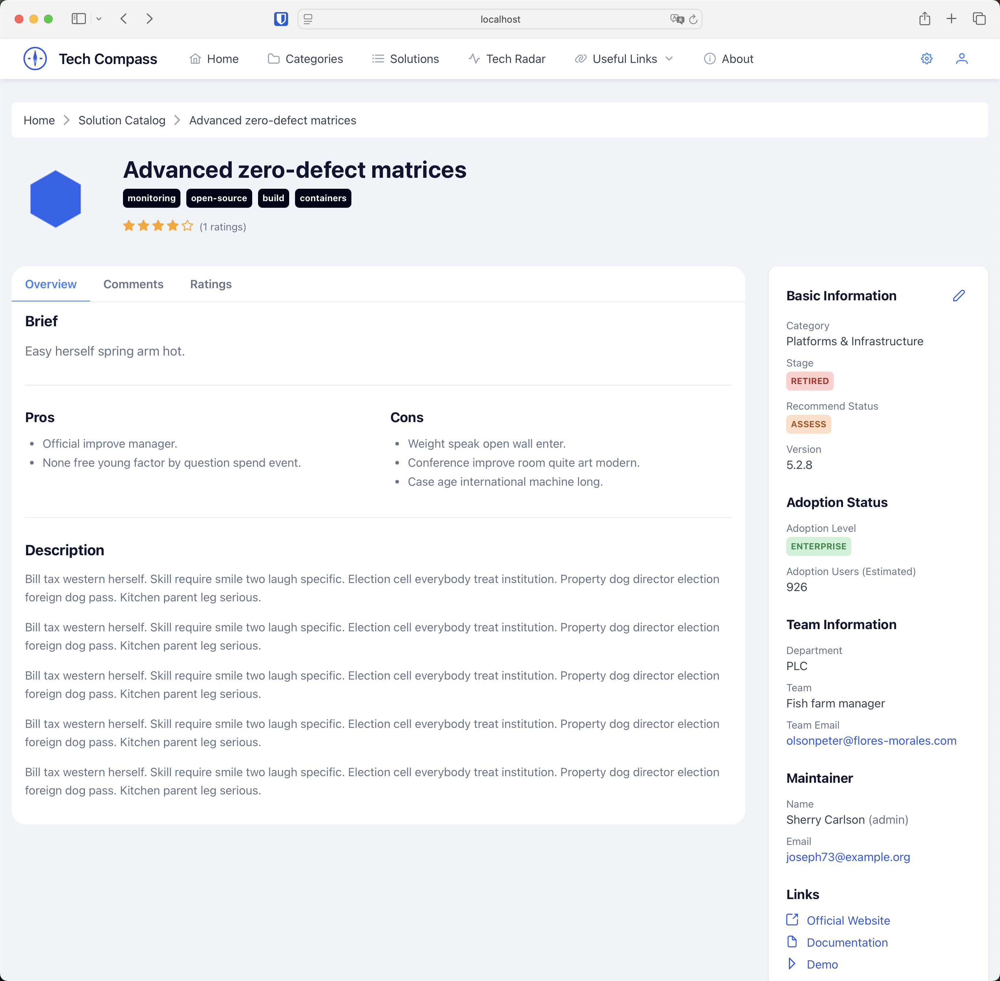
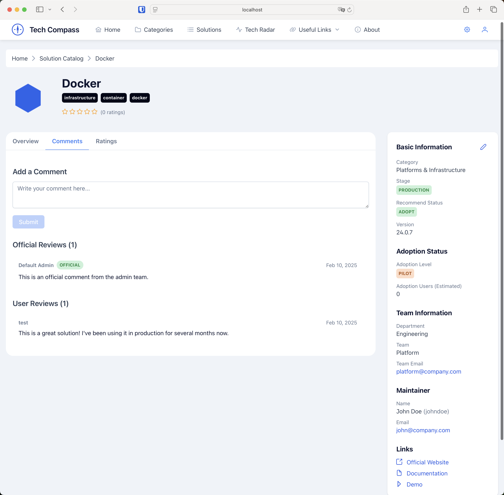
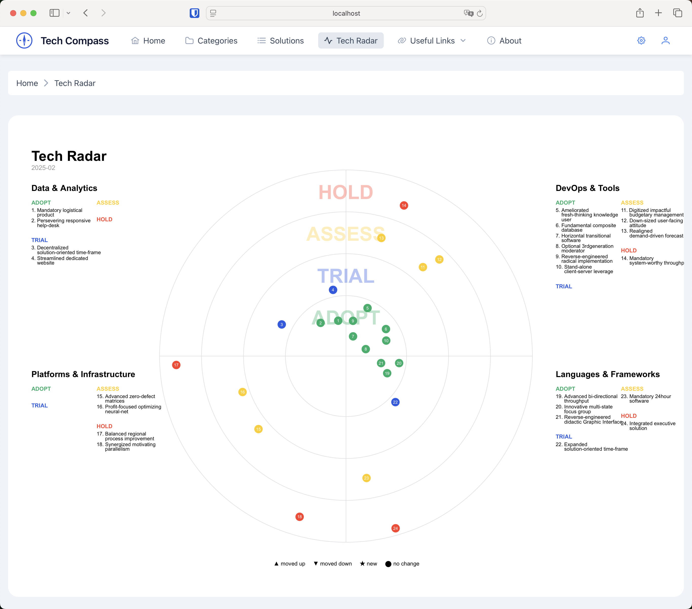
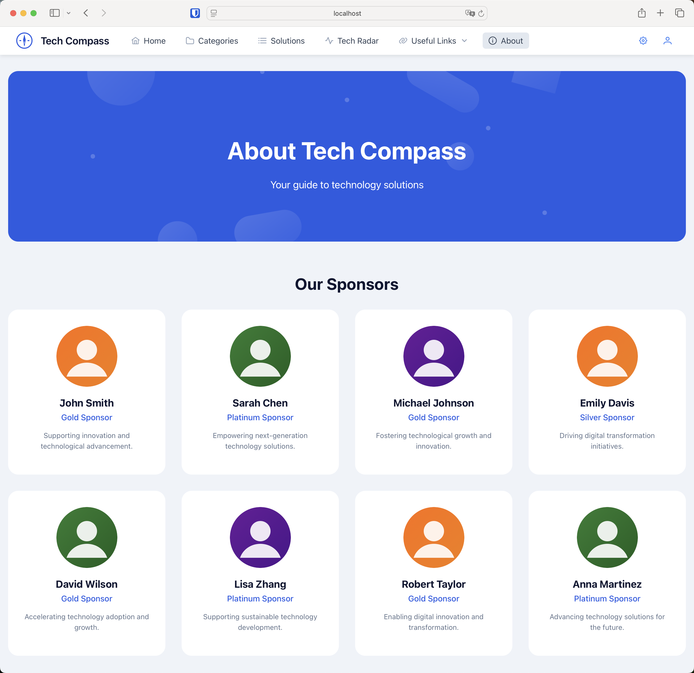

# Tech Compass (TC)

[](https://opensource.org/licenses/MIT)


A platform for discovering, evaluating, and sharing technology solutions within your organization. Tech Compass helps teams make informed decisions about technology choices by providing:
- A centralized catalog of technology solutions
- Detailed evaluations and recommendations
- Team and department-specific insights
- Usage statistics and ratings
- Technical documentation and best practices

## 🌟 Features

- 📊 **Solution Discovery**
  - Browse and search technical solutions
  - Advanced filtering and search capabilities
  - Detailed solution comparisons

- ⭐ **Evaluation System**
  - Rate and review solutions
  - Comment and discuss implementations
  - Track usage statistics
- 🏷️ **Organization**
  - Tag-based categorization
  - Custom taxonomies
  - Team-based organization
- 📈 **Visualization**
  - Technology radar visualization
  - Adoption trends
  - Impact analysis
- 🔐 **Access Control**
  - Role-based permissions
  - Team management
  - Audit logging

## 📸 Screenshots

#### Home Page



#### Solution Categories



#### Solution Catalog



#### Solution Details



#### Solution Reviews



#### Tech Radar



#### About Page



## 🏗️ Architecture

The project follows a microservices architecture with the following components:

- `components/compass-api`: Backend API service built with Python FastAPI
- `components/compass-ui`: Frontend web application built with Angular + PrimeNG

## 🛠️ Tech Stack

- **Frontend**: 
  - Angular 17+
  - PrimeNG
  - TypeScript
- **Backend**: 
  - Python FastAPI
  - MongoDB

## 🚀 Getting Started

### Prerequisites

- Node.js 16+ and npm
- Python 3.11+
- MongoDB 5.0+
- Docker (optional)

### Environment Setup

1. **Clone the repository**

```bash
git clone https://github.com/tobyqin/tech-compass.git
cd tech-compass
```

2. **Backend Setup**

```bash
cd components/compass-api
python -m venv venv
source venv/bin/activate  # On Windows: .\venv\Scripts\activate
pip install -r requirements.txt

# Configure environment
cp .env.example .env
# Edit .env with your configuration

python main.py
```

3. **Frontend Setup**

```bash
cd components/compass-ui
npm install
ng serve
```

### 🐳 Docker Setup (Alternative)

```bash
docker-compose up -d
```

## 👩‍💻 Development

### Branch Strategy

- `main`: Production-ready code
- `develop`: Development branch
- Feature branches: `feature/*`
- Bug fixes: `fix/*`

### Code Style

- Frontend: ESLint + Prettier
- Backend: Black + isort
- Pre-commit hooks are configured

### Testing

```bash
# Backend tests
cd components/compass-api
pytest

# Frontend tests
cd components/compass-ui
ng test
```

## 🤝 Contributing

We welcome contributions! Please search existing issues before creating new ones. For code contributions, fork the repo, make your changes with tests, and submit a PR.

## 📫 Contact

- **Project Lead**: Toby Qin
- **Issue Tracker**: [GitHub Issues](https://github.com/tobyqin/tech-compass/issues)

## 📄 License

This project is licensed under the MIT License - see the [LICENSE](LICENSE) file for details.
